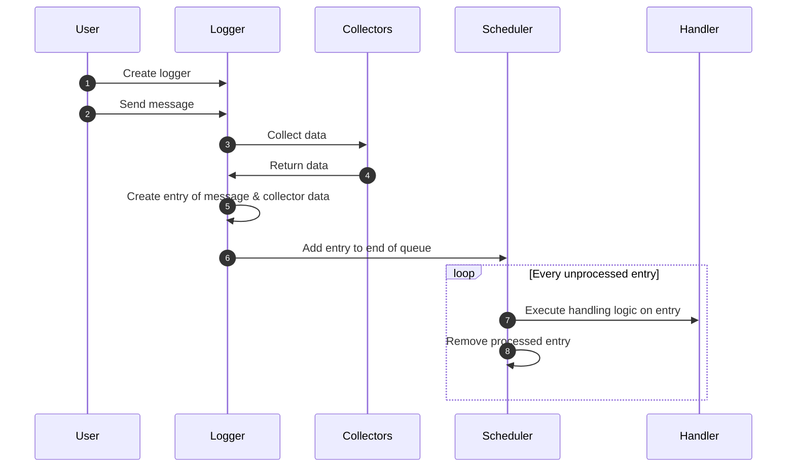

# LoggingJS
A logging library for managing logging errors/messages to servers with corresponding data.

## Quickstart
Logging Javascript errors:
```javascript
var serverHandler = new Logging.handler.RESTHandler('test/logging/errors'),
  eventLogHandlers = [serverHandler],
  errorLogger = new Logging.logger.EventLogger({handlers: eventLogHandlers});

window.addEventListener('error', errorLogger.handle);
```

Logging Javascript messages:
```javascript
var serverHandler = new Logging.handler.RESTHandler('test/logging/messages'),
  logHandlers = [serverHandler],
  logger = new Logging.logger.MessageLogger({handlers: logHandlers});

logger.info('This is a test');
```

## Model
The library is broken up into 4 main components, `loggers`, `collectors`, `handlers`, and `schedulers`, which can be composed/extended to create the logging structure that you need.




### Loggers
Loggers are the main component of the library that developers will interact with.  Loggers are configured to use `collectors` to collect data about a message, and `handlers` to do something with that data. `handlers` and `collectors` know nothing about the logger, or about the other handlers and collectors that are used by the logger.

By default, Loggers are attached with the following `Logging.logger.BaseLogger.DEFAULTBROWSERCOLLECTORS`:

* `Logging.collector.browser.NavigationCollector` - Collects information from the `window.navigator` object.
* `Logging.collector.browser.ScreenCollector` - Collects information about the screen of the current user from `window` and `window.screen`.
* `Logging.collector.browser.PerformanceCollector` - Collects information about the `window.performance` and `Performance entries`.

### Collectors
Collectors gather information about the environment at the time an event/message is logged.  These collectors read about the current state of the page/browser/etc.  Collectors must implement a `collect` method which returns the collected data to the `Logger`.  New collectors can be added created by developers to include application-specific data about the current state of their application at the time of an event/message.

### Handlers
Handlers are configurable objects that process the message/event and the associated data according to the needs of the developer. Most of the time, I anticipate most of the handlers being `RESTHandler` instances for sending `POST` data to a given API endpoint.  Handlers must implement a `handle` method which "handles" the collected data about the error/message.  New handlers can be added created by developers to handle data in ways that are not already implemented by LoggingJS.

## Schedulers
Schedulers are configurable objects for handling `Logging.handler.EntryHandler` execution.  These mainly used as a facade to more complicated patterns of executing code without blocking the main JS thread.  Schedulers must implement a `push` method for pushing handlers and entries into the scheduler to be executed at a time allotted by the scheduler, and an `isSupported` static method to determine if the scheduler is supported by the end-user's browser at run-time.

## Common Tasks

### Specifying collectors
An example to how customize which collectors are used:
```javascript
var collectors = {
  application: new ApplicationStateCollector()
}
errorLogger = new Logging.logger.EventLogger({collectors: collectors});
```

Here is an example for how to automatically retain the default collectors, and to add your own:
```javascript
var collectors = Object.assign({}, Logging.logger.BaseLogger.DEFAULTBROWSERCOLLECTORS);
  collectors['application'] = new ApplicationStateCollector();
var errorLogger = new Logging.logger.EventLogger({collectors: collectors});
```

### Specifying a scheduler
```javascript
var scheduler = new Logging.scheduler.IdleBackgroundScheduler(50) // 50 millisecond timeout of requestIdleCallback
var errorLogger = new Logging.logger.EventLogger({scheduler: scheduler});
```

### Integrating into React
```typescript
class ReactComponentCollector implements DataCollector {
  protected component: React.Component;

  constructor(component) {
    this.component = component;
  }

  collect() {
    return this.component.state;
  }

}

class MyComponent extends React.Component {

  componentDidMount() {
    var componentCollector = new ReactComponentCollector(this);
    var serverHandler = new Logging.handler.RESTHandler('test/logging/messages'),
      logHandlers = [serverHandler],
      collectors = {'component': componentCollector};
    this.logger = new Logging.logger.MessageLogger({handlers: logHandlers, collectors: collectors });
  }

}
```
